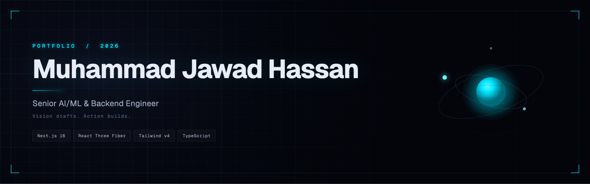

# Personal Portfolio

A dark, cinematic 3D portfolio. Next.js 16, React Three Fiber, Tailwind v4.

> _"Success is the blueprint drawn by vision and built by action."_

## Run locally

Requires Node 20+.

```bash
git clone https://github.com/Muhammad-Jawad-Hassan/PERSONAL-PORTFOLIO.git
cd PERSONAL-PORTFOLIO
npm install
npm run dev
```

Open http://localhost:3000.

## Scripts

| Command         | Purpose                  |
| --------------- | ------------------------ |
| `npm run dev`   | Start dev server         |
| `npm run build` | Production build         |
| `npm start`     | Run the production build |
| `npm run lint`  | ESLint                   |

## Stack

Next.js 16 (App Router, TypeScript) · Tailwind v4 with CSS-variable tokens · React Three Fiber, Three.js, drei, postprocessing · GSAP, Lenis, Motion · Geist Sans & Mono.

Content lives in `src/data/` as typed data. 3D scenes are in `src/components/three/`.

## Deploy

Import on [Vercel](https://vercel.com/new). No environment variables required.
